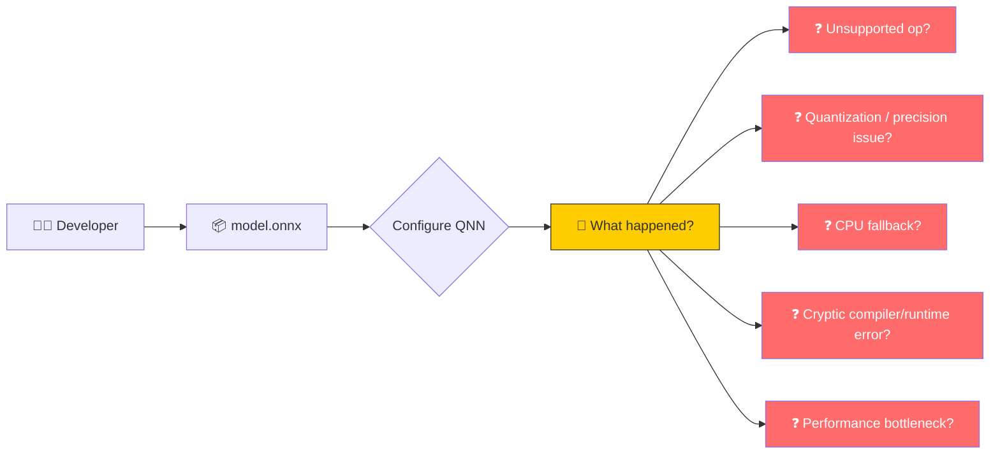
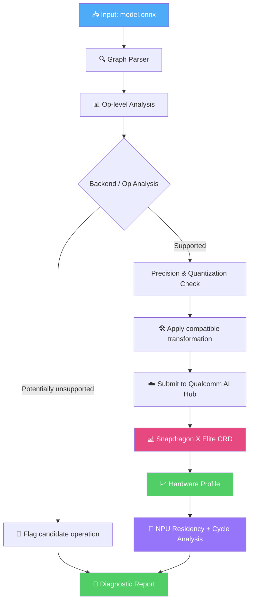
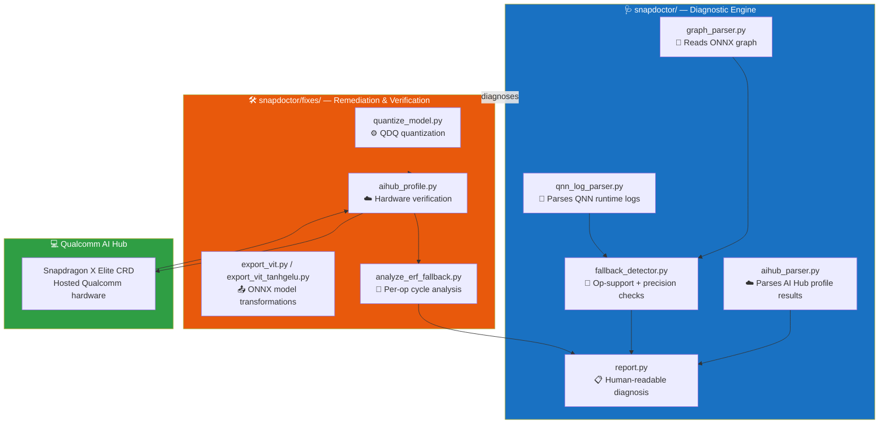
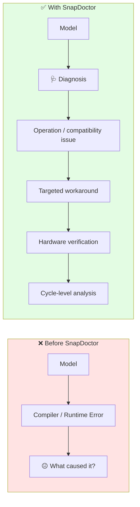

# 🩺 SnapDoctor

### AI Model Diagnostics for Snapdragon NPU Deployment


> **"Does my model actually run on the NPU — or just claim to?"**

> SnapDoctor diagnoses why AI models underperform on Snapdragon NPUs, applies targeted fixes, and verifies the result through Qualcomm AI Hub hardware profiling.

---

## 🎯 The Problem

Deploying AI models to Snapdragon devices can involve failures that are difficult to diagnose from a single compile or runtime result.



Developers may see situations such as:

| Assumption                           | What SnapDoctor investigates                                                                      |
| ------------------------------------ | ------------------------------------------------------------------------------------------------- |
| ✅ "I enabled QNNExecutionProvider"   | ⚠️ Are unsupported portions falling back to another execution provider?                           |
| ✅ "All my ops are standard ONNX ops" | ⚠️ Are those operations supported by the selected Snapdragon backend and precision configuration? |
| ✅ "It compiled fine"                 | ⚠️ Does the resulting model actually execute on the intended NPU, and how fast is it?             |
| ✅ "I fixed the compile blocker"      | ⚠️ Did the workaround introduce a measurable runtime cost?                                        |
| ✅ "The model is running on the NPU"  | ⚠️ Which operations are actually mapped to the NPU?                                               |

---

## 🚀 What SnapDoctor Does

SnapDoctor closes the loop:

**diagnose → fix → verify → analyze**



The important distinction is that SnapDoctor does not stop at:

> **"The model compiled."**

It attempts to determine:

> **"What happened when the model actually ran on the target Snapdragon device?"**

---

## 🏗️ Architecture



---

## ✅ Proven So Far

| Stage                                | Status    | Evidence                                                                                         |
| ------------------------------------ | --------- | ------------------------------------------------------------------------------------------------ |
| 🔍 Graph parsing                     | ✅ Working | Parses real ONNX models and extracts operator histograms                                         |
| 🚦 Op-support diagnosis              | ✅ Working | Uses QNN/ONNX Runtime support information to identify candidate compatibility issues             |
| 🧪 Precision / quantization analysis | ✅ Working | Detects models requiring a compatible precision/quantization path for the selected experiment    |
| 🛠️ Quantization pipeline            | ✅ Working | Static QDQ quantization through ONNX Runtime tooling                                             |
| ☁️ Hardware verification             | ✅ Proven  | ResNet18 profiled on Snapdragon X Elite through Qualcomm AI Hub                                  |
| 🔬 Cycle-level analysis              | ✅ Working | Extracts per-node cost from AI Hub `execution_detail`                                            |
| 🧩 Attention-model diagnosis         | ✅ Proven  | ViT-B/16 `Erf` compile blocker diagnosed, workaround applied, and verified on Snapdragon X Elite |
| 🎤 Cross-domain diagnosis            | ✅ Proven  | Whisper-base encoder `Erf` blocker diagnosed, workaround applied, 100% NPU residency verified on Snapdragon X Elite |

---

---

## 🖥️ CLI Dashboard

Raw script output works for development, but for a quick look at any model's NPU compatibility or hardware profile, SnapDoctor ships a `rich`-based CLI dashboard.

### Diagnose a model

```bash
python -m snapdoctor.cli report data/models/your_model.onnx [data/logs/your_log.log]
```

This renders a formatted summary instead of a plain text dump:

```text
╭──────────────────────────────────────────────╮
│ Diagnosing: whisper_base_encoder_tanhgelu.onnx │
╰──────────────────────────────────────────────╯

Op-level NPU compatibility: 67.4% (219/325 ops)

              Unsupported / Fallback Ops
 ─────────────────────────────────────────────
  Op                        Type      Reason
 ─────────────────────────────────────────────
  /layers.0/self_attn/...   Reshape   'Reshape' not in known QNN-supported op set
  ...

HTP (NPU) runnable: False
  Model appears fully float32 — run quantize_model.py before deployment.
```

The `log_path` argument is optional — omit it to run static op-support diagnosis without QNN runtime fallback correlation.

> **Note:** the unsupported-ops table is capped at 15 rows for terminal readability; the total count and a "...and N more" line are always shown.

### Analyze a hardware profile

```bash
python -m snapdoctor.cli analyze reports/your_model_profile_raw.json
```

Renders NPU residency and a ranked cost-by-node-type breakdown from a real AI Hub `execution_detail` profile:

```text
╭─────────────────────────────╮
│ Hardware Profile Analysis     │
╰─────────────────────────────╯
NPU residency: 304/304 ops (100%)
Total cycles: 544,520,982

           Top Cost Contributors
 ────────────────────────────────────────
  Node Type              Cycles    % of Total   Node Count
 ────────────────────────────────────────
  /layers.4/self       30,411,859     5.6%          30
  /layers.0/self       30,334,474     5.6%          30
  ...
```

Both commands wrap the same diagnostic engine used by `report.py` and `analyze_erf_fallback.py` — no separate logic, just a cleaner presentation layer over the same hardware-verified data.

---

## 📊 Real Hardware Result — ResNet18

### Snapdragon X Elite CRD via Qualcomm AI Hub

```text
NPU Residency:        100.0% (36/36 layers)
Estimated Inference:  ~348 µs
Warm Load Time:       ~345.9 ms
Peak Inference Memory: ~11.2 MB
```

All profiled ResNet18 layers were reported on the NPU for this hardware run.

> **This is a measured hardware-profile result, not a simulated estimate.**

---

## 🔬 Case Study: ViT-B/16 GELU Bottleneck

Attention-based models exposed a different class of problem: a compile-time blocker involving the exact GELU implementation.

### 1. The blocker

The original ViT-B/16 graph used an exact GELU implementation containing an `Erf` operation.

The AI Hub/QNN compilation path failed with:

```text
ErfDummyLayoutInferer not implemented
```

This prevented the original graph from compiling successfully.

---

### 2. The workaround

SnapDoctor replaced the exact GELU formulation with a tanh-based approximation.

The transformed model successfully:

* compiled through Qualcomm AI Hub,
* profiled on Snapdragon X Elite,
* executed its profiled operations on the NPU.

---

### 3. The hidden cost

The workaround introduced additional computation into the graph.

In the unquantized tanh-approximation experiment, `Tanh`/`Pow`-related computation became a significant portion of the measured cycle cost.

This demonstrated an important diagnostic principle:

> **A workaround that removes a compiler blocker can still introduce a measurable runtime cost.**

---

### 4. The quantization experiment

SnapDoctor then tested a second model in which the Tanh/Pow path was included in the QDQ quantization experiment.

The measured result was:

| Metric            | Unquantized baseline | Tanh/Pow QDQ |
| ----------------- | -------------------: | -----------: |
| Compile           |            ✅ SUCCESS |    ✅ SUCCESS |
| Profile           |            ✅ SUCCESS |    ✅ SUCCESS |
| Total cycles      |          333,590,783 |  266,078,340 |
| Inference latency |               ~72 ms |     ~52.7 ms |
| NPU residency     |                 100% |         100% |

The QDQ experiment reduced measured inference latency by approximately **27%** in this comparison.

However, cycle-level tracing showed that the Tanh/Pow computation itself remained a major structural cost in the transformed graph.

The latest profile reported:

```text
Total cycles:              266,078,340

GELU-related nodes:         28,766,117 cycles
GELU-related share:          ~10.8%

Watched operations:
144 / 144 on NPU
```

The key finding is therefore not simply:

> "Quantization made GELU faster."

Instead:

> **The overall graph became faster, while the transformed GELU path remained a significant computational component.**

This is exactly the type of distinction SnapDoctor is designed to expose.

---
---

## 🔬 Case Study: Whisper-Base Encoder — Cross-Domain Validation

The ViT experiment proved SnapDoctor works on vision transformers. The natural next question: does the same diagnostic pipeline generalize to a completely different modality — audio — without any changes to the core engine?

### 1. The setup

Whisper-base's encoder (6 transformer layers, Conv-based audio stem, fixed 30-second/3000-frame spectrogram input) was exported to ONNX and run through the unmodified SnapDoctor pipeline — `graph_parser.py`, `fallback_detector.py`, `aihub_parser.py`, and `report.py` were untouched from the ViT/ResNet18 runs.

### 2. The blocker — same failure class, new model

Whisper's encoder uses exact GELU (`Erf`) in two places: the 6 per-layer transformer blocks *and* the convolutional audio stem. Static diagnosis flagged both:

```text
Op-level NPU compatibility: 65.6% (187/285 ops)
Unsupported: Erf (6 occurrences), Reshape/Constant (known static-analysis false positives)
```

This is the same failure class SnapDoctor identified in ViT-B/16 — confirming `Erf` is a general QNN/AI Hub compatibility gap, not a ViT-specific quirk.

### 3. The workaround — and a wrinkle unique to Whisper

Swapping to a tanh-approximation GELU via `config.activation_function = "gelu_new"` fixed the 6 per-layer blocks, but the conv-stem's GELU calls `F.gelu` directly in Whisper's `forward()` method, bypassing the config-driven activation module. A targeted monkey-patch (`F.gelu = gelu_tanh`) was needed to catch both call sites. Re-running diagnosis confirmed zero remaining `Erf` ops.

This is itself a useful diagnostic finding: **the same fix pattern (config swap) doesn't always fully resolve the same op class (Erf) across different model architectures** — SnapDoctor's two-pass diagnose → verify workflow caught the gap that a single fix-and-ship attempt would have missed.

### 4. Hardware verification result

| Metric               |                Result |
| --------------------- | ---------------------: |
| Compile                |               ✅ SUCCESS |
| Profile                |               ✅ SUCCESS |
| NPU residency          |          100% (304/304 ops) |
| Mean inference latency |                ~119.6 µs |
| Total cycles            |             544,520,982 |
| Peak inference memory   |                ~21.3 MB |

Every op in the profiled graph — including the quantized Tanh/Pow GELU workaround — executed on the NPU. Zero CPU/GPU fallback.

### 5. A different bottleneck than ViT — not the same story repeated

Unlike ViT, where the Tanh/Pow GELU workaround was the dominant cost, cycle-level analysis of the Whisper encoder shows the bottleneck sits elsewhere entirely:

```text
Top cost contributors (of 544.5M total cycles):
  FFN fc1 MatMul dequant (6 layers):     ~154M cycles (~28%)
  FFN fc1 Add (6 layers):                 ~95M cycles (~17%)
  Self-attention blocks (6 layers):      ~180M cycles (~33%)

175/175 watched ops ran on NPU.
```

The GELU/Tanh-Pow workaround does not appear among the top cost contributors here. The dominant cost is FFN (`fc1`) matrix multiplication and its FP16 dequantization overhead — a structurally different bottleneck than the GELU-driven cost found in ViT.

**This is the key cross-domain finding:** the same diagnostic method (quantize → profile → trace per-node cycles) surfaces a *different, architecture-specific* bottleneck depending on the model — exactly what a genuine diagnostic tool should do, rather than reporting the same generic result regardless of input.

| | ViT-B/16 | Whisper-base encoder |
|---|---|---|
| Erf blocker | ✅ Found | ✅ Found |
| Fix applied | Tanh-approx GELU | Tanh-approx GELU (+ conv-stem patch) |
| NPU residency | 100% | 100% |
| Dominant cost driver | Tanh/Pow GELU path (~58% combined) | FFN MatMul dequant (~28%) |

---

## 🧠 What SnapDoctor Learned

The ViT experiment demonstrates three different failure/performance classes:

### Class 1 — Compilation failure

```text
Erf
 ↓
QNN / AI Hub compiler failure
 ↓
Model cannot compile
```

### Class 2 — Successful compilation with workaround

```text
Erf
 ↓
Tanh-based GELU approximation
 ↓
Model compiles
 ↓
NPU execution succeeds
```

### Class 3 — Performance hotspot

```text
Tanh / Pow / GELU-related computation
 ↓
Large cycle contribution
 ↓
Hardware-measured performance cost
```

Therefore SnapDoctor is evolving beyond a simple **"NPU fallback detector"** into a broader model diagnostics pipeline:

```text
                 SnapDoctor
                     │
        ┌────────────┼────────────┐
        ↓            ↓            ↓
   Compatibility  Residency   Performance
        │            │            │
   Unsupported     CPU/GPU     Cycle-level
      ops          fallback     hotspots
        │            │            │
        └────────────┼────────────┘
                     ↓
              Actionable diagnosis
```

---

## 🚧 In Progress

```mermaid
flowchart LR
    A["✅ ResNet18<br/>CNN baseline"]
    --> B["✅ ViT-B/16<br/>Attention + GELU"]
    B --> C["✅ Whisper-base<br/>Speech encoder"]
    C --> D["⏳ ControlNet block<br/>Diffusion-specific ops"]
    D --> E["⏳ SnapGen Control<br/>Full demo application"]

    style A fill:#51cf66,color:#fff
    style B fill:#51cf66,color:#fff
    style C fill:#51cf66,color:#fff
    style D fill:#ffd43b,color:#222
    style E fill:#adb5bd,color:#fff

* [x] CNN model pipeline — ResNet18 diagnosed → transformed → hardware-verified
* [x] Attention model pipeline — ViT-B/16 `Erf` blocker diagnosed → GELU workaround → hardware profiling
* [x] Cross-domain validation — Whisper-base encoder (speech), same `Erf` blocker class, same fix pattern, 100% NPU residency, distinct bottleneck identified
* [x] Cycle-level analysis from AI Hub profile data
* [x] Tanh/Pow QDQ experiment
* [ ] Diffusion-specific / ControlNet-shaped blocks
* [ ] SnapGen Control — Stable Diffusion + ControlNet demonstration

---

## 📂 Project Structure

```text
snapdoctor/
│
├── snapdoctor/
│   │
│   ├── graph_parser.py
│   │   └── Reads and analyzes ONNX graphs
│   │
│   ├── qnn_log_parser.py
│   │   └── Parses QNN runtime information
│   │
│   ├── fallback_detector.py
│   │   └── Compatibility / fallback diagnostics
│   │
│   ├── aihub_parser.py
│   │   └── Parses Qualcomm AI Hub profile results
│   │
│   ├── report.py
│   │   └── Generates diagnostic reports
│   │
│   └── fixes/
│       │
│       ├── quantize_model.py
│       │   └── Static QDQ quantization
│       │
│       ├── export_vit.py
│       │   └── Clean ViT ONNX export
│       │
│       ├── export_vit_tanhgelu.py
│       │   └── ViT GELU workaround export
│       │
│       ├── aihub_profile.py
│       │   └── Qualcomm AI Hub compilation + profiling
│       │
│       └── analyze_erf_fallback.py
│           └── Per-node cycle / bottleneck analysis
│
├── snapgen/
│   └── ControlNet demo application (in progress)
│
├── data/
│   ├── models/
│   │   └── ONNX model files (gitignored)
│   │
│   └── logs/
│       └── Runtime / profiling artifacts
│
├── reports/
│   └── Diagnostic and profile JSON files
│
├── configs/
│   └── model_config.yaml
│
├── save_profile.py
├── requirements.txt
└── README.md
```

---

## ⚡ Quick Start

### 1. Clone

```bash
git clone https://github.com/Mysteriousboy727/Snapit.git
cd Snapit
```

### 2. Create environment

```bash
python -m venv .venv
```

### Windows PowerShell

```powershell
.venv\Scripts\activate
```

### 3. Install dependencies

```bash
pip install -r requirements.txt
```

---

### Diagnose an ONNX model

```bash
python -m snapdoctor.report data/models/your_model.onnx data/logs/your_log.log
```

---

### Quantize a model

```bash
python -m snapdoctor.fixes.quantize_model `
    data/models/your_model.onnx `
    data/models/your_model_qdq.onnx `
    --calib-dir data/calibration
```

---

### Configure Qualcomm AI Hub

```bash
qai-hub configure --api_token YOUR_TOKEN
```

---

### Compile and profile on Snapdragon X Elite

```bash
python -m snapdoctor.fixes.aihub_profile `
    data/models/your_model_qdq.onnx `
    --device "Snapdragon X Elite CRD"
```

---

### Analyze a saved AI Hub profile

```bash
python -m snapdoctor.fixes.analyze_erf_fallback `
    reports/your_model_profile_raw.json
```

---

## 🔬 Diagnostic Philosophy

SnapDoctor separates three questions that are often treated as one:

### 1. Can the model compile?

```text
ONNX graph
    ↓
QNN / AI Hub compilation
    ↓
SUCCESS / FAILURE
```

### 2. Where does the model execute?

```text
Compiled graph
    ↓
Hardware profile
    ↓
NPU / CPU / GPU execution information
```

### 3. What is actually expensive?

```text
Hardware profile
    ↓
execution_detail
    ↓
Node / operator cycle analysis
    ↓
Performance hotspot
```

This separation is important because:

> **Compile success does not automatically tell you the runtime performance or execution placement of every operation.**

---

## 🔑 Why This Matters



SnapDoctor is not intended to replace Qualcomm's compiler or runtime.

It focuses on the developer-facing gap between:

> **"My model targets Snapdragon."**

and

> **"I understand what happened when this model was compiled and profiled on the target Snapdragon NPU."**

---

## 🛠️ Tech Stack


---

## 📌 Current Status

**SnapDoctor is under active development.**

Current milestone:

```text
✅ ONNX graph diagnostics
        ↓
✅ Quantization pipeline
        ↓
✅ Snapdragon X Elite compilation
        ↓
✅ Hardware profiling
        ↓
✅ NPU residency analysis
        ↓
✅ Cycle-level bottleneck analysis
        ↓
⏳ ControlNet / diffusion-specific diagnostics
        ↓
⏳ SnapGen Control demonstration
```

---

## 📜 License

MIT License
