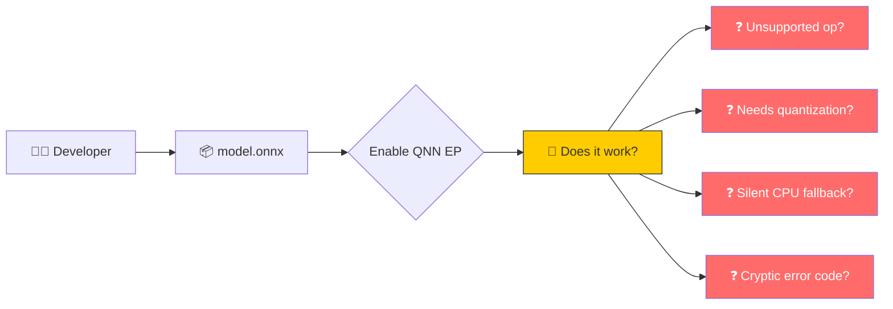
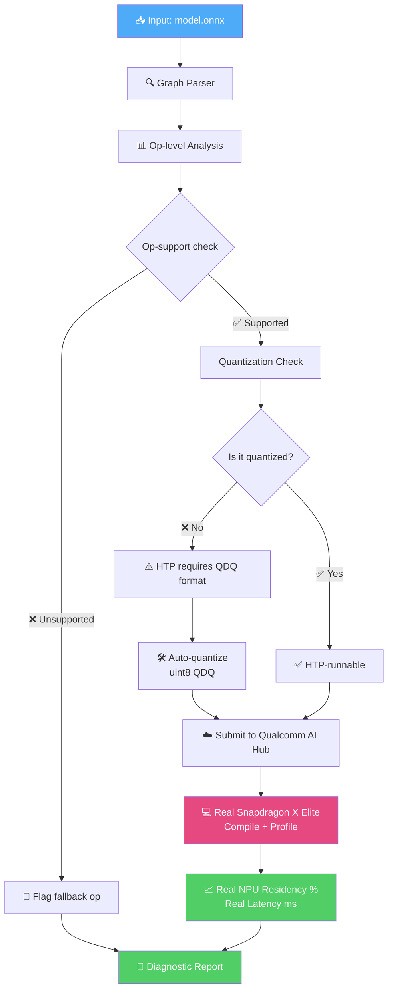
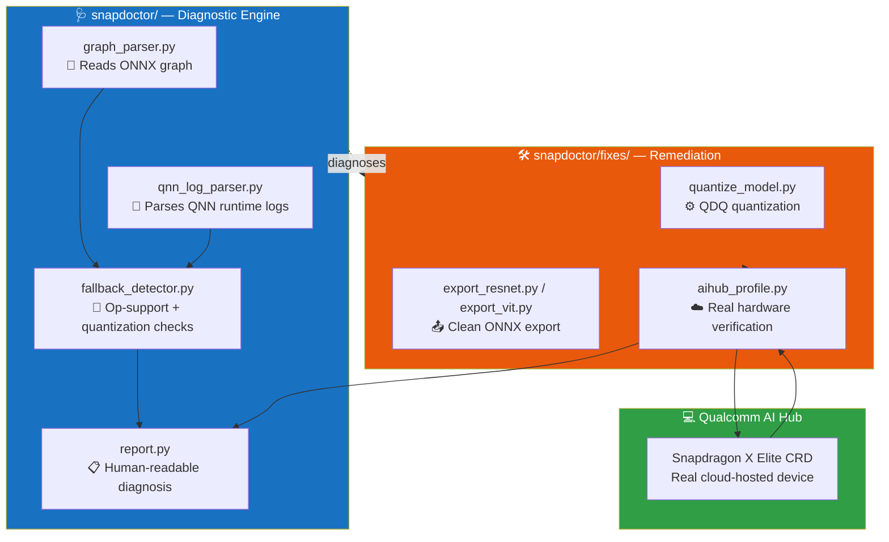
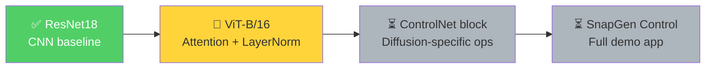
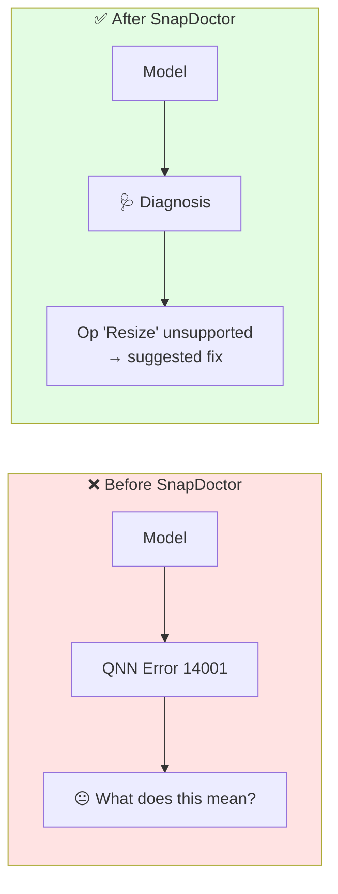

# 🩺 SnapDoctor

### AI Model Diagnostics for Snapdragon NPU Deployment


> **"Does my model actually run on the NPU — or just claim to?"**
> SnapDoctor diagnoses why AI models underperform on Snapdragon NPUs, fixes the issues it finds, and verifies the fix on real hardware.

---

## 🎯 The Problem

Developers deploying AI models on Snapdragon devices hit a wall of silent failures:



Developers **think** they're getting NPU acceleration. Reality often looks like:

| Assumption | Reality |
|---|---|
| ✅ "I enabled QNNExecutionProvider" | ⚠️ Silent fallback to CPU for unsupported ops |
| ✅ "All my ops are standard ONNX ops" | ⚠️ HTP backend **requires quantization** — fp32 models never touch NPU |
| ✅ "It compiled fine" | ⚠️ Compiles ≠ runs efficiently ≠ runs on NPU at all |

---

## 🚀 What SnapDoctor Does

SnapDoctor closes the loop: **diagnose → fix → verify on real hardware.**



---

## 🏗️ Architecture



---

## ✅ Proven So Far

| Stage | Status | Evidence |
|---|---|---|
| 🔍 Graph parsing | ✅ Working | Parses real ONNX models, extracts op histogram |
| 🚦 Op-support diagnosis | ✅ Working | Full QNN EP op list, sourced from [official docs](https://onnxruntime.ai/docs/execution-providers/QNN-ExecutionProvider.html) |
| 🧪 Quantization-requirement check | ✅ Working | Correctly flags fp32 models as non-HTP-runnable |
| 🛠️ Quantization fix pipeline | ✅ Working | uint8 QDQ quantization via ONNX Runtime tools |
| ☁️ Real hardware verification | ✅ **Proven on real Snapdragon X Elite** | ResNet18 → **100% NPU residency**, ~350µs inference, reproduced across 3 independent runs |

### 📊 Real Hardware Result (ResNet18, quantized)

```
==================================================
REAL HARDWARE PROFILE — Snapdragon X Elite (via Qualcomm AI Hub)
==================================================
NPU Residency (verified on-device): 100.0% (36/36 layers)
Estimated inference time: 348 µs
Warm load time: 345,853 µs
Peak inference memory: ~11.2 MB

All layers confirmed running on NPU (real hardware).
```

> Every single layer executed on `compute_unit: NPU` — not estimated, not simulated. Measured on real Qualcomm AI Hub cloud-hosted Snapdragon X Elite silicon.

---

## 🚧 In Progress



- [x] CNN model pipeline (ResNet18) — diagnosed → quantized → hardware-verified
- [ ] Attention-based model pipeline (ViT-B/16) — testing op-support against LayerNorm/Softmax/Gelu
- [ ] Diffusion-specific ops (ControlNet-shaped blocks)
- [ ] SnapGen Control — the flagship visual demo (Stable Diffusion + ControlNet on NPU)

---

## 📂 Project Structure

```
snapdoctor/
├── snapdoctor/              # 🩺 Core diagnostic engine
│   ├── graph_parser.py      #    Reads ONNX graphs
│   ├── qnn_log_parser.py    #    Parses QNN runtime logs
│   ├── fallback_detector.py #    Op-support + quantization checks
│   ├── report.py            #    Human-readable + AI Hub reports
│   └── fixes/
│       ├── quantize_model.py    # QDQ quantization
│       ├── export_resnet.py     # Clean ONNX export (CNN baseline)
│       ├── export_vit.py        # Clean ONNX export (attention model)
│       └── aihub_profile.py     # Real Snapdragon hardware verification
├── snapgen/                 # 🎨 ControlNet demo app (in progress)
├── data/
│   ├── models/               # ONNX model files
│   └── logs/                 # QNN logs + AI Hub profiles
└── configs/
    └── model_config.yaml
```

---

## ⚡ Quick Start

```bash
# Clone and set up
git clone https://github.com/Mysteriousboy727/Snapit.git
cd snapit
python -m venv venv
venv\Scripts\activate          # Windows
pip install -r requirements.txt

# Run diagnosis on a model
python -m snapdoctor.report data/models/your_model.onnx data/logs/your_log.log

# Quantize a model for NPU deployment
python -m snapdoctor.fixes.quantize_model data/models/your_model.onnx data/models/your_model_qdq.onnx

# Verify on real Snapdragon hardware (requires Qualcomm AI Hub API token)
qai-hub configure --api_token YOUR_TOKEN
python -m snapdoctor.fixes.aihub_profile
```

---

## 🔑 Why This Matters



We're not claiming to fix Qualcomm's hardware. We're closing the gap between **"Snapdragon has an NPU"** and **"a developer can reliably understand, deploy, and verify their model on it."**

---

## 🛠️ Tech Stack


---

<div align="center">


</div>
